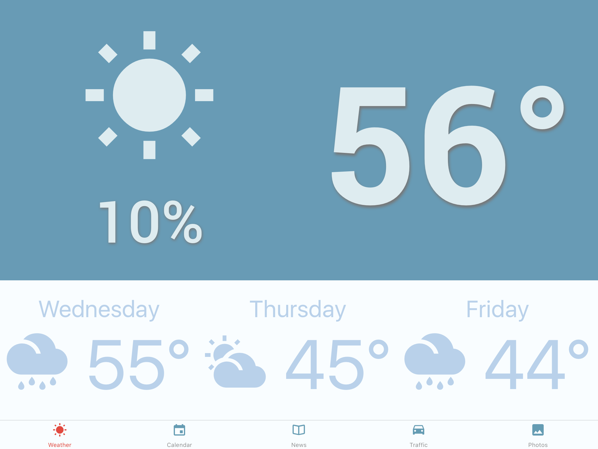
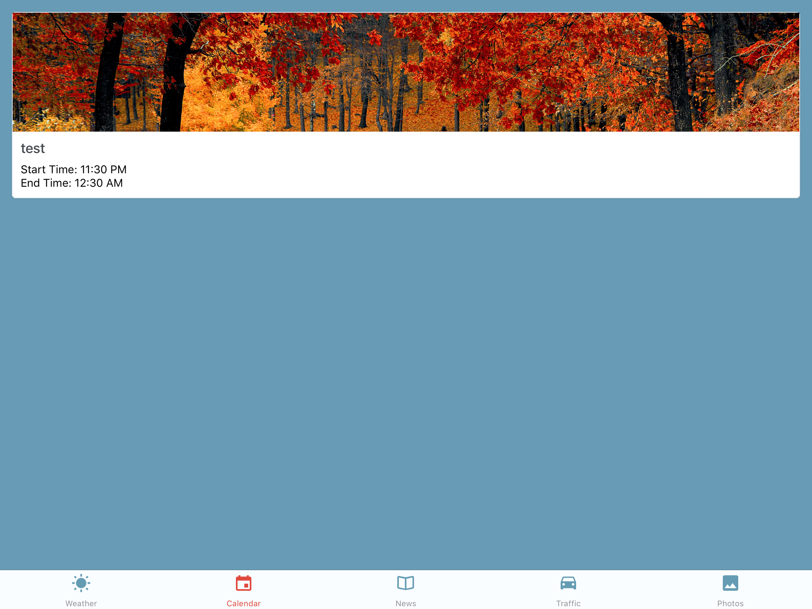
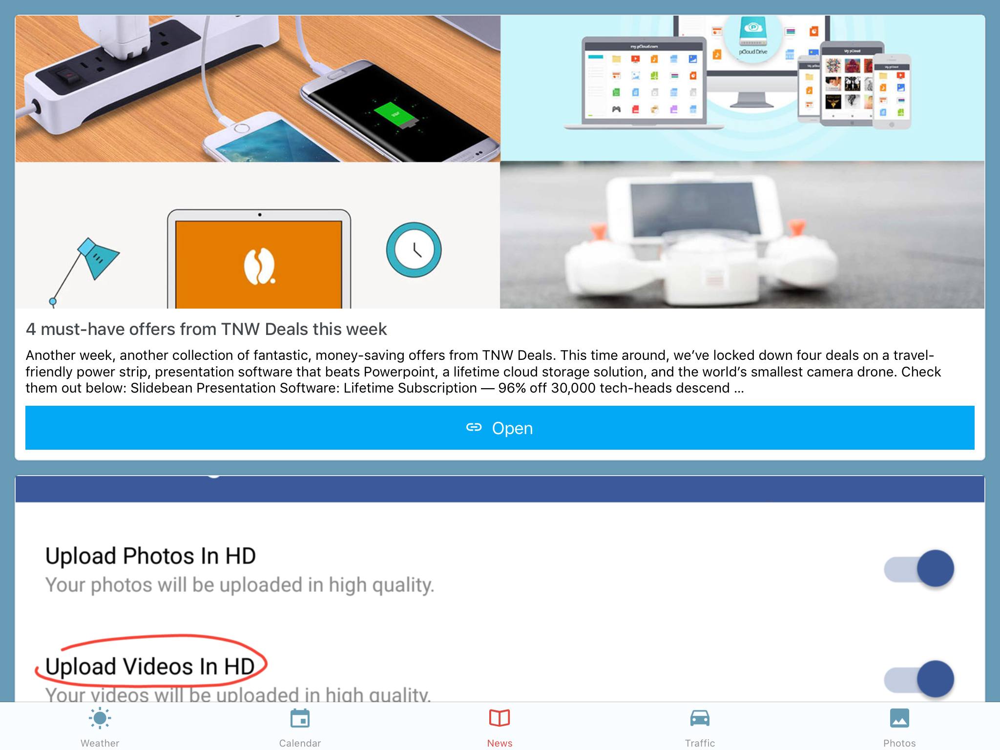
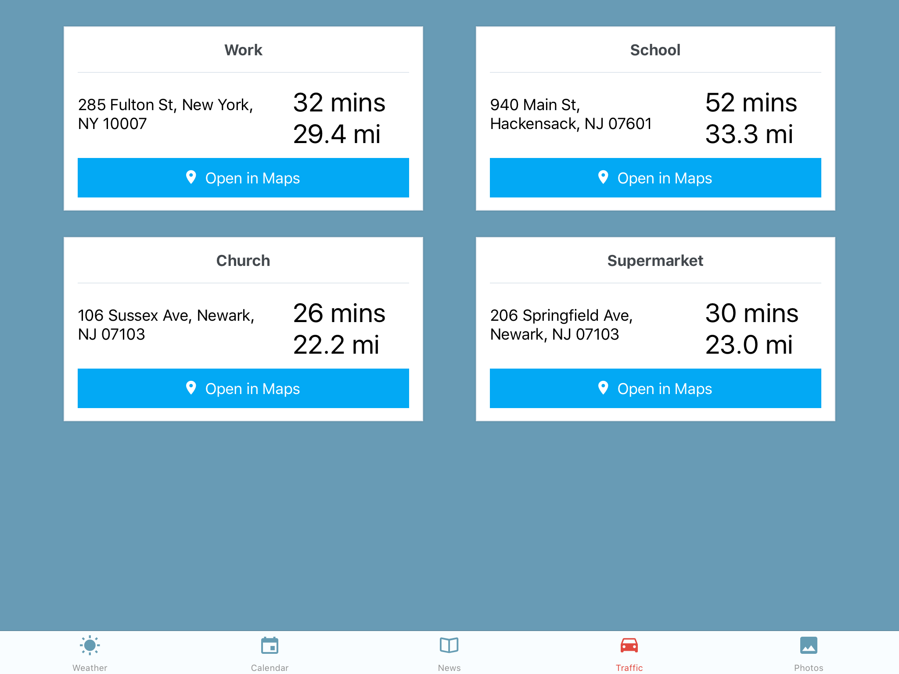

Smart S is a mobile application for Android and iOS tablets that turns any device you might have available (high-end or low-end) into an simple, attractive, informative kiosk for your home. Smart S application provides you information about Weather, News, Traffic Predictions and when idle it turns into a photo slideshow

### Get Weather Info

<iframe width="560" height="315" src="https://www.youtube.com/embed/OrO5AMTQnf0?rel=0&amp;controls=0&amp;showinfo=0" frameborder="0" allow="autoplay; encrypted-media" allowfullscreen></iframe>

### Get Calendar Info

### Get Latest News

### Get Commute Info

### Slideshows your photos

